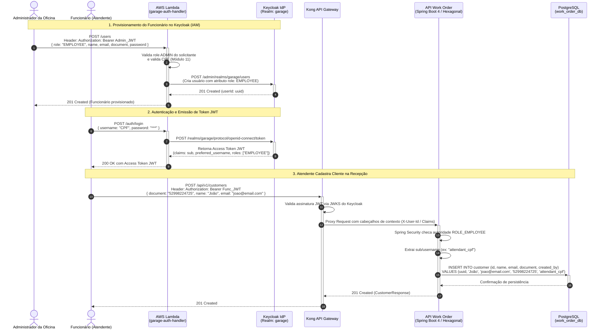

# Plano de Implementação: Funcionário como Identidade IAM (Keycloak) e Auditoria por Claims JWT

> **Decisão do Usuário**: Opção 1 - Funcionário como Identidade IAM (Keycloak) + Auditoria por Claims JWT
> **Status**: Aprovado para Execução

---

## 1. Contexto e Declaração do Problema
No fluxo operacional da oficina mecânica, os clientes não realizam autoatendimento desassistido na recepção; eles são atendidos e cadastrados presencialmente por um **funcionário da oficina** (atendente/recepcionista).

Para suportar esse fluxo de forma moderna e desacoplada:
1. **Evitar duplicação desnecessária de tabelas**: O funcionário não precisa de uma tabela relacional de RH própria no banco `work_order_db`, pois não possui atributos de faturamento ou catálogo. Ele é uma **identidade autenticada** gerenciada pelo Identity Provider (**Keycloak**).
2. **Controle de Acesso RBAC**: Apenas usuários com perfil/role `EMPLOYEE` ou `ADMIN` têm permissão para cadastrar clientes, veículos e abrir Ordens de Serviço.
3. **Rastreabilidade e Auditoria Transacional**: Ao persistir entidades como `customer` ou `work_order`, o identificador do funcionário que operou o sistema é extraído das claims do token Bearer JWT (`sub` ou `preferred_username`) e registrado nas colunas de auditoria (`created_by`, `last_modified_by`).

---

## 2. Desenho Arquitetural da Solução



---

## 3. Mudanças a Serem Aplicadas no Repositório

### 3.1. Documentação Viva & Diagramas de BDD (`15soat-phase4-e2e`)
- **Arquivo**: `src/test/resources/features/work-order/customer_vehicle_management.md`
  - Incorporar o fluxo onde o ator principal é explicitamente o `Atendente (Funcionário Autenticado com Role EMPLOYEE)`.
  - Documentar a passagem do header `Authorization: Bearer Employee_JWT`.
  - Explicar nas notas técnicas que a identificação do funcionário é auditada no banco via claim JWT sem requerer tabela `employee`.

### 3.2. Registro de Decisão Arquitetural (`ADR-005`)
- **Arquivo [NEW]**: `docs/adr/005-gestao-identidade-funcionarios-auditoria-jwt.md`
  - **Contexto**: Avaliação entre criar uma tabela relacional `employee` vs. centralizar no IAM Keycloak.
  - **Decisão**: Adoção do Keycloak como única fonte da verdade para identidades e permissões de funcionários com auditoria de claims (`created_by`) no PostgreSQL.
  - **Consequências**: Eliminação de redundâncias, menor acoplamento e suporte nativo a RBAC.
- **Arquivo [MODIFY]**: `docs/adr/README.md`
  - Atualizar a matriz de decisões incluindo a ADR-005.

### 3.3. Cenários de BDD (`customer_vehicle_management.feature`)
- Garantir que os cenários expressem que as requisições administrativas/atendimento são emitidas por um atendente autenticado:
  ```gherkin
  Given an authenticated attendant with "EMPLOYEE" role
  When the attendant creates a new customer with the following details:
  ...
  ```

---

## 4. Plano de Verificação e Testes
1. **Verificação de Documentação**: Validar se o Mermaid em `customer_vehicle_management.md` compila perfeitamente sem falhas de sintaxe e com activation boxes (`+`/`-`).
2. **Rastreabilidade Git**: Confirmar status com `git status -s`.
3. **Aprovação Prévia**: Consultar o usuário para autorização formal antes de qualquer commit ou push.
