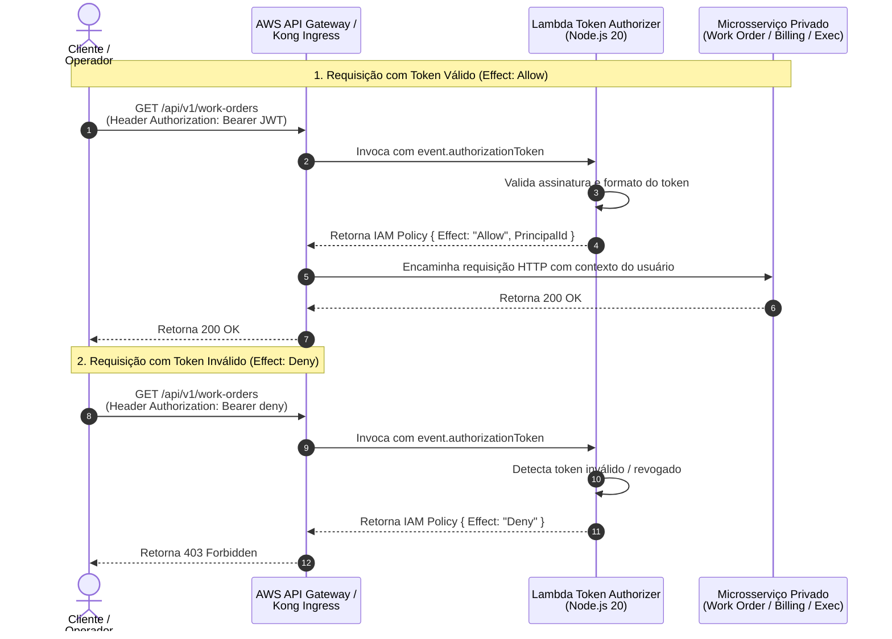

## Diagrama de Sequência

**Autenticação e Autorização Serverless via Lambda Token Authorizer (Referência: `auth_token_authorizer.feature`)**

Este diagrama documenta a validação stateless de tokens Bearer JWT no API Gateway através do AWS Lambda Token Authorizer, controlando o acesso aos microsserviços privados.

