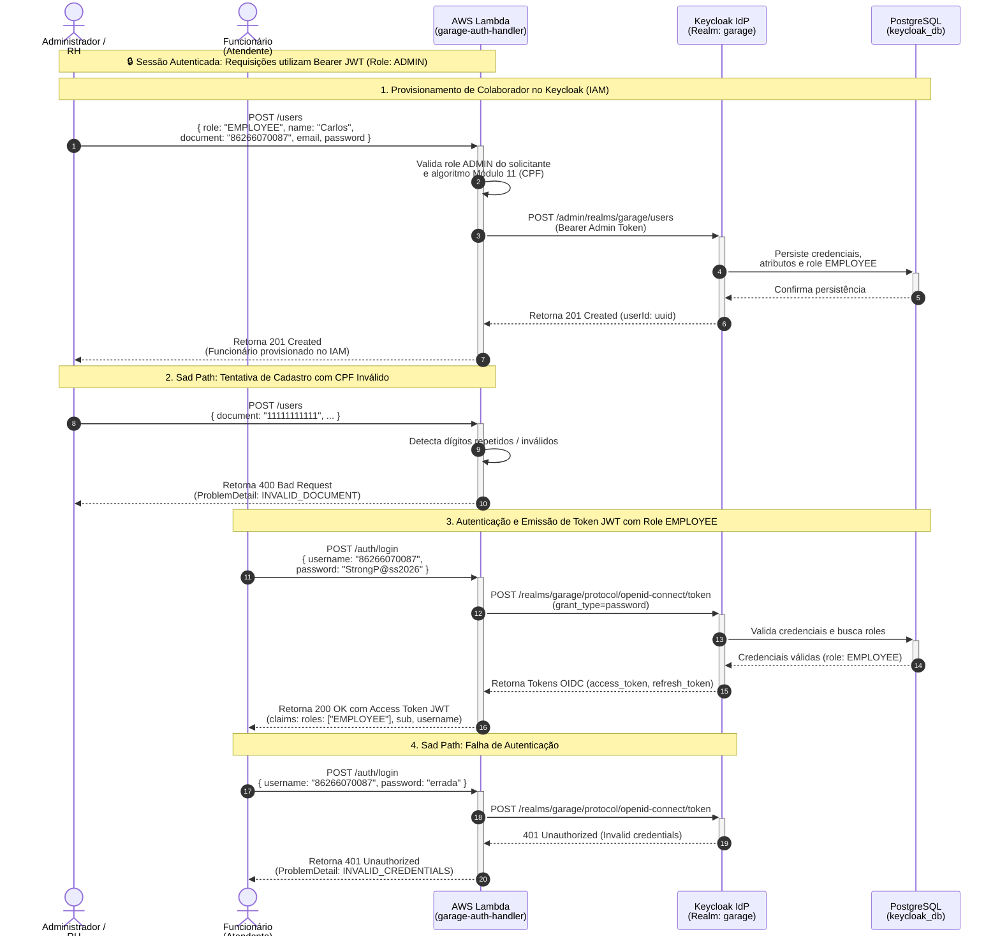

## Diagrama de Sequência

**Gestão de Identidade e Autenticação de Funcionários (Referência: `employee_identity_management.feature`)**

Este diagrama documenta o ciclo de vida do colaborador da oficina:
1. **Provisionamento Seguro pelo Administrador**: Cadastro via **AWS Lambda** (`POST /users`), que valida permissão administrativa, validação algorítmica de CPF (Módulo 11) e cria o usuário no **Keycloak (IdP)** com a role `EMPLOYEE`.
2. **Autenticação OIDC & Emissão de JWT**: O colaborador realiza o login via `POST /auth/login`, obtendo o token JWT contendo as claims necessárias (`roles: ["EMPLOYEE"]`, `sub`, `preferred_username`) para operar o sistema no API Gateway.

