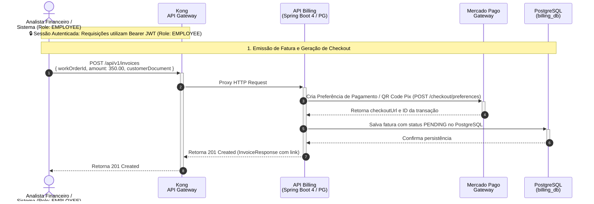

## Diagrama de Sequência

**Geração de Faturas e Checkout Mercado Pago (Referência: `invoice_generation.feature`)**

Este diagrama documenta o fluxo de emissão de faturas e integração com o Mercado Pago para disponibilização de checkout e QR Code Pix, com persistência no PostgreSQL.

