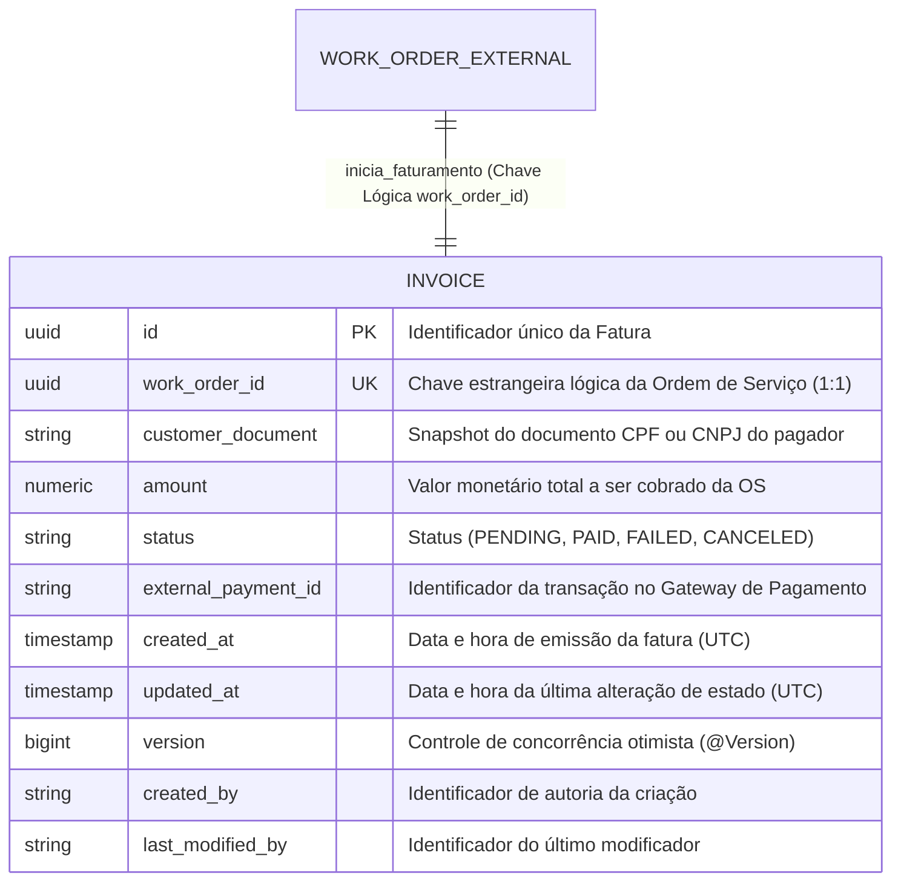

# Diagrama do Modelo de Dados & MER (`15soat-phase4-api-billing`)

Este documento descreve a modelagem de dados relacional do microsserviço de Faturamento e Cobranças (`billing_db`), implementada em **PostgreSQL** e versionada através de migrações gerenciadas pelo **Flyway** (`db/migration/V1__init_billing_schema.sql`).

---

## 1. Diagrama Entidade-Relacionamento (MER)

---

## 2. Dicionário de Dados

### Tabela: `invoice`

A tabela `invoice` é o agregado raiz do módulo de faturamento, persistindo a obrigação financeira gerada para o cliente após a aprovação do orçamento de uma Ordem de Serviço.

* **`id`** (`UUID`, Chave Primária): Identificador único imutável da fatura gerado pela aplicação.
* **`work_order_id`** (`UUID`, NOT NULL, UNIQUE): Referência lógica à Ordem de Serviço de origem gerenciada pelo `api-work-order`. A unicidade garante que uma Ordem de Serviço possua rigorosamente uma única fatura emitida, impedindo cobrança duplicada.
* **`customer_document`** (`VARCHAR(14)`, NOT NULL): Snapshot do CPF (11 dígitos) ou CNPJ (14 dígitos) do cliente no momento da cobrança.
* **`amount`** (`NUMERIC(12, 2)`, NOT NULL): Valor monetário exato a ser liquidado junto ao gateway de pagamento (Mercado Pago).
* **`status`** (`VARCHAR(30)`, NOT NULL): Estado atual da fatura:
  - `PENDING`: Aguardando pagamento pelo cliente (QR Code Pix / Checkout gerado).
  - `PAID`: Pagamento confirmado com sucesso pelo gateway de pagamento.
  - `FAILED`: Pagamento recusado, expirado ou reprovado pela instituição financeira.
  - `CANCELED`: Fatura cancelada devido a cancelamento da Ordem de Serviço.
* **`external_payment_id`** (`VARCHAR(100)`): Código de identificação retornado pelo provedor de pagamento (ex: Mercado Pago Payment ID) utilizado para reconciliação e rastreamento em webhooks assíncronos.
* **`created_at`** (`TIMESTAMP WITH TIME ZONE`, NOT NULL, DEFAULT NOW()): Momento de emissão da fatura em UTC.
* **`updated_at`** (`TIMESTAMP WITH TIME ZONE`, NOT NULL, DEFAULT NOW()): Momento da última alteração de status em UTC.
* **`version`** (`BIGINT`, NOT NULL, DEFAULT 0): Controle de concorrência otimista (JPA `@Version`), prevenindo conflitos concorrentes de webhook ou atualização manual.
* **`created_by` / `last_modified_by`** (`VARCHAR(100)`): Rastreamento de auditoria da entidade.

---

## 3. Índices Estratégicos de Performance

Para garantir consultas instantâneas durante as etapas da Saga e no processamento de callbacks de pagamentos, os seguintes índices foram modelados:

| Nome do Índice | Coluna(s) | Finalidade / Caso de Uso |
| :--- | :--- | :--- |
| `idx_invoice_work_order_id` | `work_order_id` | Busca de fatura por Ordem de Serviço (Saga & consultas de status). |
| `idx_invoice_status` | `status` | Filtragem de faturas por estado (ex: relatórios de pendentes ou auditoria). |
| `idx_invoice_external_payment_id` | `external_payment_id` | Rápida localização da fatura ao receber Webhooks do Mercado Pago. |
