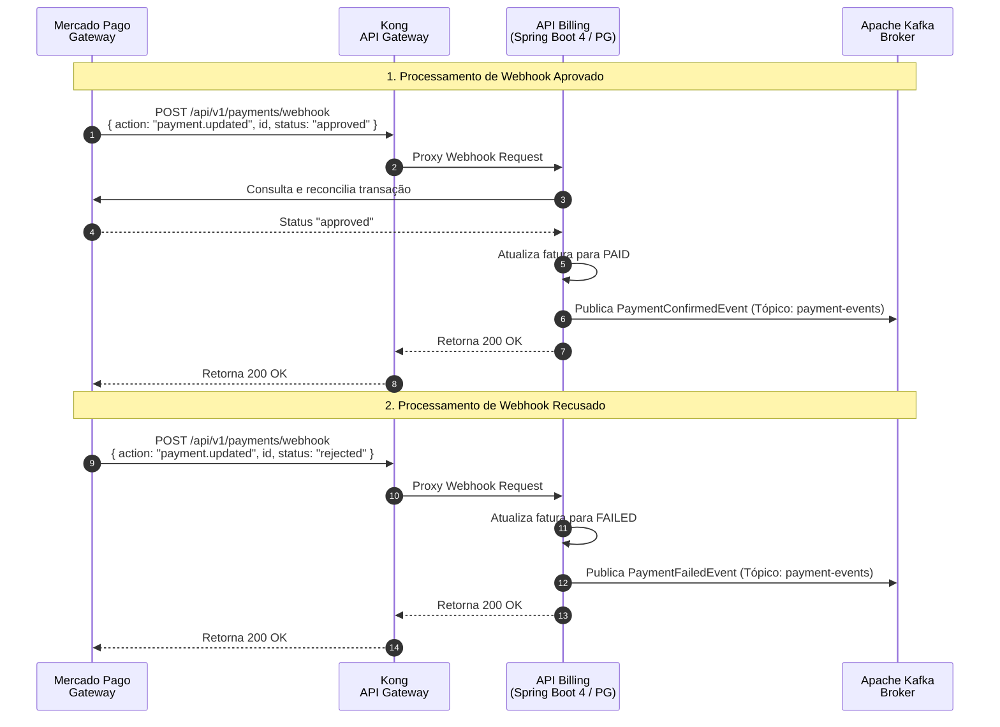

## Diagrama de Sequência

**Processamento de Webhooks de Pagamento e Liquidação (Referência: `payment_webhook_processing.feature`)**

Este diagrama documenta o recebimento e reconciliação dos webhooks do Mercado Pago, cobrindo o fluxo de aprovação e o fluxo de recusa com publicação de eventos transacionais no Apache Kafka.

