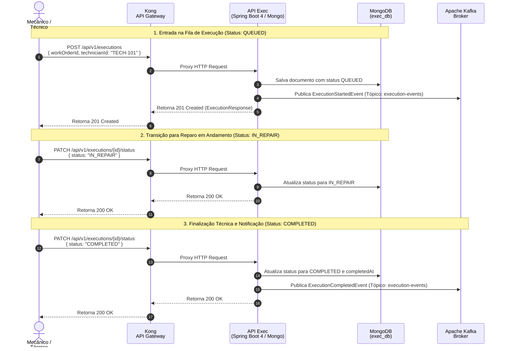

## Diagrama de Sequência

**Gerenciamento da Fila de Oficina e Execução de Reparos (Referência: `execution_queue_and_repair.feature`)**

Este diagrama documenta a entrada do veículo na fila de oficina, avanço de status durante os reparos e finalização técnica com persistência documental no MongoDB e emissão de eventos no Kafka.

