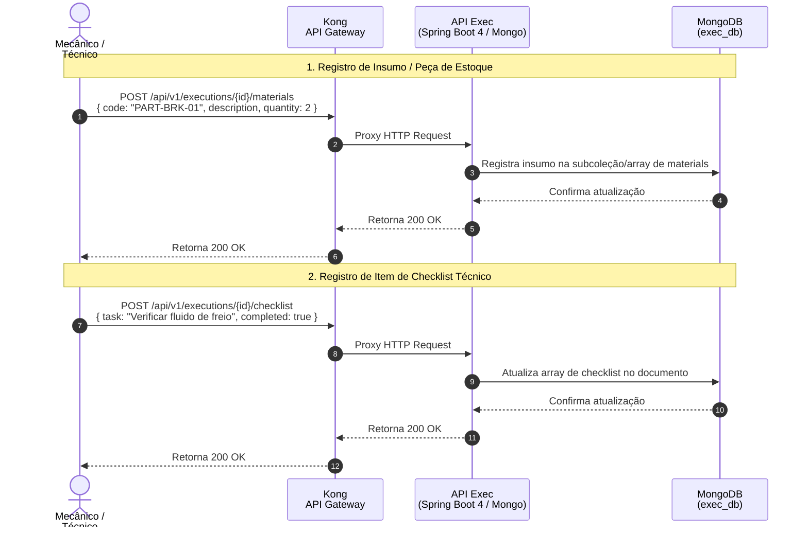

## Diagrama de Sequência

**Gestão de Materiais de Estoque e Checklists Técnicos (Referência: `materials_and_checklist.feature`)**

Este diagrama documenta o lançamento de insumos e preenchimento de checklists operacionais de inspeção com persistência documental no MongoDB.

