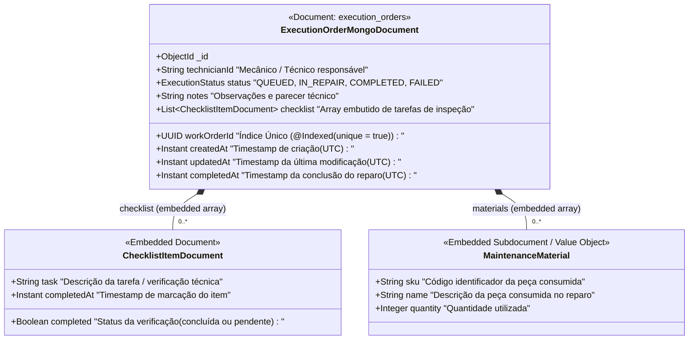

# Diagrama do Modelo de Dados & NoSQL Document Schema (`15soat-phase4-api-exec`)

Este documento descreve a modelagem NoSQL orientada a documentos do microsserviço de Execução de Oficina (`exec_db`), implementada em **MongoDB** (compatível com AWS DocumentDB) via Spring Data MongoDB.

---

## 1. Visão Geral da Modelagem Documental

Diferente dos microsserviços relacionais (`work-order` e `billing`), o microsserviço **`api-exec`** adota uma estratégia **NoSQL baseada em Agregados DDD (Aggregate Root)**:

- **Documento Atômico e Autossuficiente**: A ordem de execução na oficina (`execution_orders`) consolida a fila física, os apontamentos de baia e os itens dinâmicos em um único documento BSON.
- **Subdocumentos Embutidos (Embedded Documents)**: Checklists técnicos de inspeção mecânica e peças aplicadas são persistidos como arrays embutidos (`checklist` e `materials`), eliminando a necessidade de joins ou integridade referencial distribuída.
- **Rastreabilidade e Idempotência**: O campo `workOrderId` possui índice único (`@Indexed(unique = true)`), garantindo que cada Ordem de Serviço da oficina possua uma única esteira física de execução em andamento.

---

## 2. Diagrama de Classes e Estrutura do Documento

<div style="overflow-x: auto; width: 100%;">
<div style="min-width: 850px;">



</div>
</div>

---

## 3. Coleção: `execution_orders`

* **`_id`** (`ObjectId`): Identificador primário nativo do MongoDB gerado no momento da inserção.
* **`workOrderId`** (`UUID / String`, Index Único): Identificador de correlação com a Ordem de Serviço de origem.
* **`technicianId`** (`String`): Identificador do mecânico alocado na baia de trabalho (ex: `TECH-CARLOS-01`).
* **`status`** (`String`, Index): Estado da ordem na oficina (`QUEUED`, `IN_REPAIR`, `COMPLETED`, `FAILED`).
* **`notes`** (`String`): Diagnóstico textual, anotações de serviço e parecer da bancada.
* **`checklist`** (`Array<ChecklistItemDocument>`): Lista dinâmica de verificações mecânicas e itens de segurança (óleo, suspensão, freios, filtros).
* **`materials`** (`Array<MaintenanceMaterial>`): Peças e consumíveis requisitados na baia.
* **`createdAt` / `updatedAt`** (`Instant / Date`): Auditoria temporal gerenciada pelo ciclo de vida do documento.
* **`completedAt`** (`Instant / Date`): Data e hora de conclusão física do reparo na oficina.

---

## 4. Exemplo de Documento BSON / JSON Persistido

```json
{
  "_id": { "$oid": "66f4b1a23c4d5e6f7a8b9c0d" },
  "workOrderId": "a1b2c3d4-e5f6-7a8b-9c0d-e1f2a3b4c5d6",
  "technicianId": "TECH-CARLOS-01",
  "status": "IN_REPAIR",
  "notes": "Veículo com desgaste acentuado nas pastilhas dianteiras. Substituição efetuada.",
  "checklist": [
    {
      "task": "Verificar nível e viscosidade do óleo do motor",
      "completed": true,
      "completedAt": "2026-10-01T14:30:00Z"
    },
    {
      "task": "Inspecionar espessura das pastilhas e discos de freio",
      "completed": true,
      "completedAt": "2026-10-01T15:10:00Z"
    }
  ],
  "materials": [
    {
      "sku": "PART-BRK-01",
      "name": "Pastilha de Freio Dianteira Cerâmica",
      "quantity": 2
    }
  ],
  "createdAt": "2026-10-01T14:00:00Z",
  "updatedAt": "2026-10-01T15:15:00Z",
  "completedAt": null
}
```
