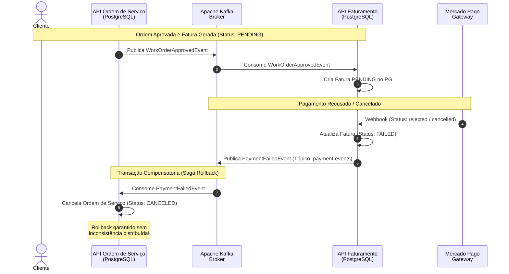

## Diagrama de Sequência

**Transação Compensatória e Rollback da Saga Distribuída (Referência: `compensating_saga_rollback.feature`)**

Este diagrama documenta o mecanismo transacional de compensação (Saga Rollback) disparado pelo Apache Kafka quando o pagamento é recusado, garantindo o cancelamento atômico da Ordem de Serviço.

