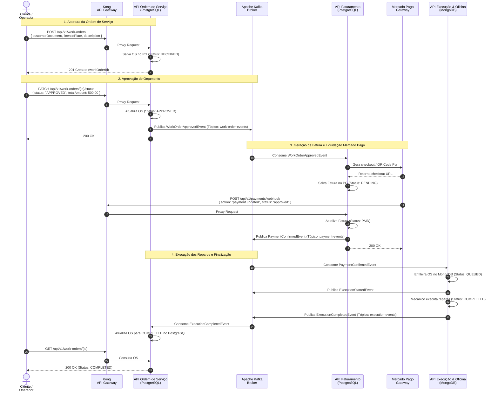

## Diagrama de Sequência

**Coreografia Completa da Saga Distribuída - Happy Path (Referência: `complete_choreographed_saga.feature`)**

Este diagrama documenta a coordenação distribuída assíncrona orientada a eventos via Apache Kafka entre os microsserviços `api-work-order`, `api-billing` e `api-exec` no fluxo feliz completo.

