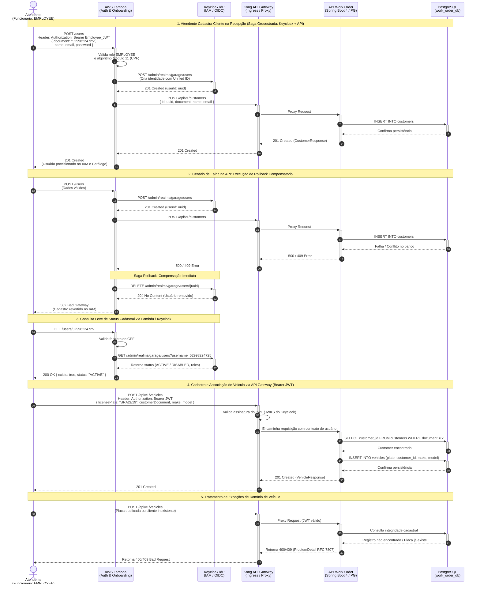

## Diagrama de Sequência

**Gestão de Clientes e Veículos (Arquitetura Integrada Phase 3 / Phase 4)**

Este diagrama documenta o ciclo completo de onboarding de clientes e gestão de veículos, alinhado à arquitetura serverless da **Phase 3**:
1. **Onboarding Serverless com Saga Orquestrada**: A **AWS Lambda** recebe a requisição pública via Function URL, valida o CPF (algoritmo Módulo 11 da Receita Federal), provisiona a identidade no **Keycloak (IdP)** e propaga os dados para a **API Work Order** no cluster EKS. Caso a API falhe, a Lambda executa **Saga Compensatória (Rollback)** deletando o usuário no Keycloak.
2. **Consulta Direta de Usuário**: Verificação leve de existência e status de usuário diretamente no Keycloak via Lambda (`GET /users/{cpf}`).
3. **Gestão de Veículos e Operações Autenticadas**: Operações de negócio realizadas via **Kong API Gateway** utilizando token **Bearer JWT** emitido pelo Keycloak.

