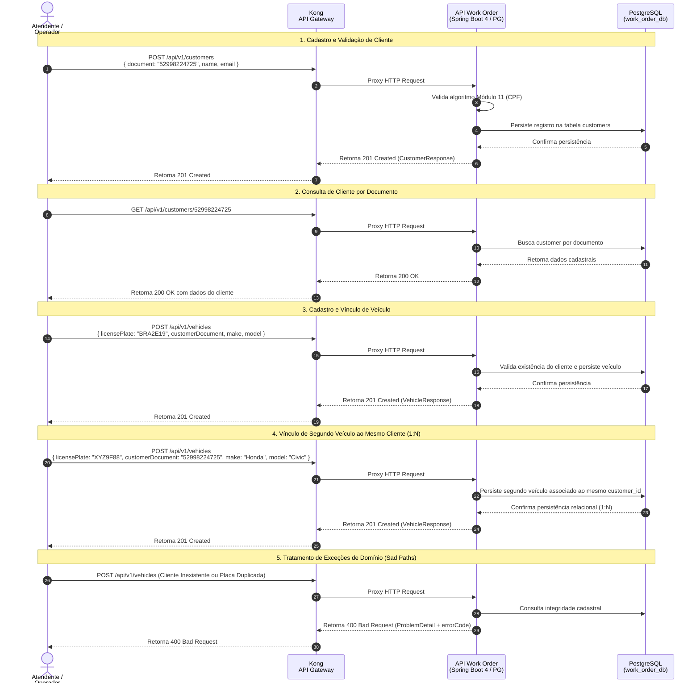

## Diagrama de Sequência

**Gestão de Clientes e Veículos Vinculados (Referência: `customer_vehicle_management.feature`)**

Este diagrama documenta o fluxo de cadastro e consulta de clientes e seus respectivos veículos através do API Gateway Kong até o microsserviço de Ordens de Serviço com persistência relacional no PostgreSQL.

