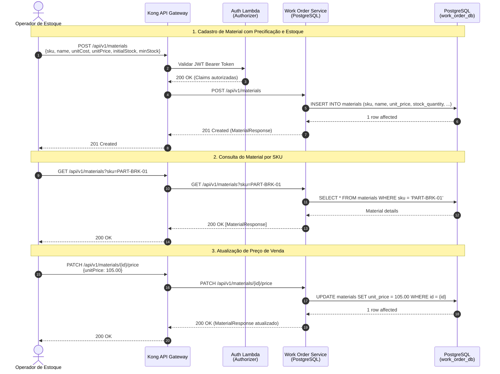

# Diagrama de Sequência: Gestão e Precificação de Materiais

```mermaid
sequenceDiagram
    autonumber
    actor Operator as Operador de Estoque
    participant Kong as Kong API Gateway
    participant Auth as Auth Lambda<br/>(Authorizer)
    participant WorkOrder as Work Order Service<br/>(PostgreSQL)
    participant DB as PostgreSQL<br/>(work_order_db)

    Note over Operator,DB: 1. Cadastro de Material com Precificação e Estoque
    Operator->>Kong: POST /api/v1/materials<br/>{sku, name, unitCost, unitPrice, initialStock, minStock}
    Kong->>Auth: Validar JWT Bearer Token
    Auth-->>Kong: 200 OK (Claims autorizadas)
    Kong->>WorkOrder: POST /api/v1/materials
    WorkOrder->>DB: INSERT INTO materials (sku, name, unit_price, stock_quantity, ...)
    DB-->>WorkOrder: 1 row affected
    WorkOrder-->>Kong: 201 Created (MaterialResponse)
    Kong-->>Operator: 201 Created

    Note over Operator,DB: 2. Consulta do Material por SKU
    Operator->>Kong: GET /api/v1/materials?sku=PART-BRK-01
    Kong->>WorkOrder: GET /api/v1/materials?sku=PART-BRK-01
    WorkOrder->>DB: SELECT * FROM materials WHERE sku = 'PART-BRK-01'
    DB-->>WorkOrder: Material details
    WorkOrder-->>Kong: 200 OK [MaterialResponse]
    Kong-->>Operator: 200 OK

    Note over Operator,DB: 3. Atualização de Preço de Venda
    Operator->>Kong: PATCH /api/v1/materials/{id}/price<br/>{unitPrice: 105.00}
    Kong->>WorkOrder: PATCH /api/v1/materials/{id}/price
    WorkOrder->>DB: UPDATE materials SET unit_price = 105.00 WHERE id = {id}
    DB-->>WorkOrder: 1 row affected
    WorkOrder-->>Kong: 200 OK (MaterialResponse atualizado)
    Kong-->>Operator: 200 OK
```

