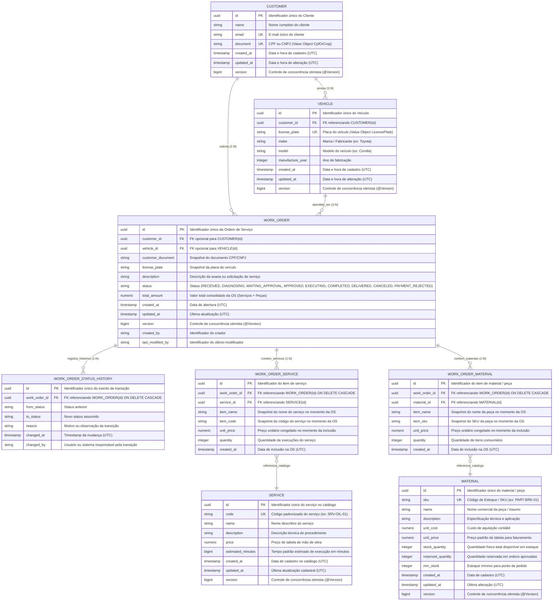

# Diagrama do Modelo de Dados & MER (`15soat-phase4-api-work-order`)

Este documento descreve a modelagem de dados relacional do microsserviço de Gestão de Ordens de Serviço (`work_order_db`), implementada em **PostgreSQL** e versionada através de migrações gerenciadas pelo **Flyway** (`db/migration/V1__...` a `V4__...`).

---

## 1. Diagrama Entidade-Relacionamento (MER)

---

## 2. Dicionário de Dados e Tabelas

### `customer`
Armazena o cadastro mestre dos clientes da oficina mecânica.
* **`id`** (`UUID`, PK): Identificador imutável.
* **`name`** (`VARCHAR(255)`, NOT NULL): Nome completo do cliente.
* **`email`** (`VARCHAR(255)`, NOT NULL, UNIQUE): Contato de e-mail institucional ou pessoal.
* **`document`** (`VARCHAR(14)`, NOT NULL, UNIQUE): CPF (11 dígitos) ou CNPJ (14 dígitos).
* **`created_at` / `updated_at`** (`TIMESTAMP WITH TIME ZONE`): Rastreamento temporal em UTC.
* **`version`** (`BIGINT`): Lock otimista JPA.

### `vehicle`
Armazena os veículos sob responsabilidade de cada cliente.
* **`id`** (`UUID`, PK): Identificador do veículo.
* **`customer_id`** (`UUID`, FK `customer.id` RESTRICT): Proprietário do veículo.
* **`license_plate`** (`VARCHAR(10)`, NOT NULL, UNIQUE): Placa Mercosul ou padrão antigo.
* **`make`** (`VARCHAR(100)`, NOT NULL): Marca ou fabricante (ex: Toyota, Honda).
* **`model`** (`VARCHAR(100)`, NOT NULL): Modelo do veículo.
* **`manufacture_year`** (`INTEGER`, NOT NULL): Ano de fabricação do veículo.

### `work_order`
Agregado principal do microsserviço, gerencia a solicitação, aprovação de orçamento, status de produção e encerramento comercial.
* **`id`** (`UUID`, PK): Identificador único da OS.
* **`customer_id` / `vehicle_id`** (`UUID`, FKs opcionais ON DELETE SET NULL): Referência estruturada caso existam no cadastro.
* **`customer_document` / `license_plate`** (`VARCHAR`): Snapshots imutáveis informados na abertura.
* **`description`** (`VARCHAR(500)`, NOT NULL): Diagnóstico inicial ou queixa do cliente.
* **`status`** (`VARCHAR(30)`, NOT NULL): Estado atual do ciclo de vida da OS.
* **`total_amount`** (`NUMERIC(12,2)`, NOT NULL): Consolidado monetário calculado.

### `work_order_status_history`
Trilha cronológica completa de transições de status da Ordem de Serviço para fins de auditoria e cálculo de métricas de permanência (Lead Time por etapa).
* **`id`** (`UUID`, PK): Identificador do registro histórico.
* **`work_order_id`** (`UUID`, FK `work_order.id` CASCADE): Ordem de serviço referenciada.
* **`from_status`** (`VARCHAR(30)`): Status anterior (nulo na criação).
* **`to_status`** (`VARCHAR(30)`, NOT NULL): Status de destino.
* **`reason`** (`VARCHAR(500)`): Justificativa do operador, cliente ou evento da Saga.
* **`changed_at`** (`TIMESTAMP WITH TIME ZONE`, NOT NULL): Momento exato da transição.
* **`changed_by`** (`VARCHAR(100)`): Identificador do operador ou sistema.

### `work_order_service` e `work_order_material`
Itens vinculados à OS, preservando snapshots do valor e identificadores nominais contratados (ADR 0002).
* **`item_name` / `item_code` / `item_sku`**: Snapshots congelados do catálogo no momento da inclusão.
* **`unit_price`**: Preço unitário contratado, imune a alterações cadastrais posteriores.
* **`quantity`**: Quantidade solicitada/utilizada.

### `service` e `material`
Catálogos padronizados de serviços (mão de obra) e materiais (peças de reposição e consumíveis).
* Em `material`, a coluna **`reserved_quantity`** gerencia o compromisso de estoque para OSs aprovadas antes da baixa física definitiva na conclusão.
