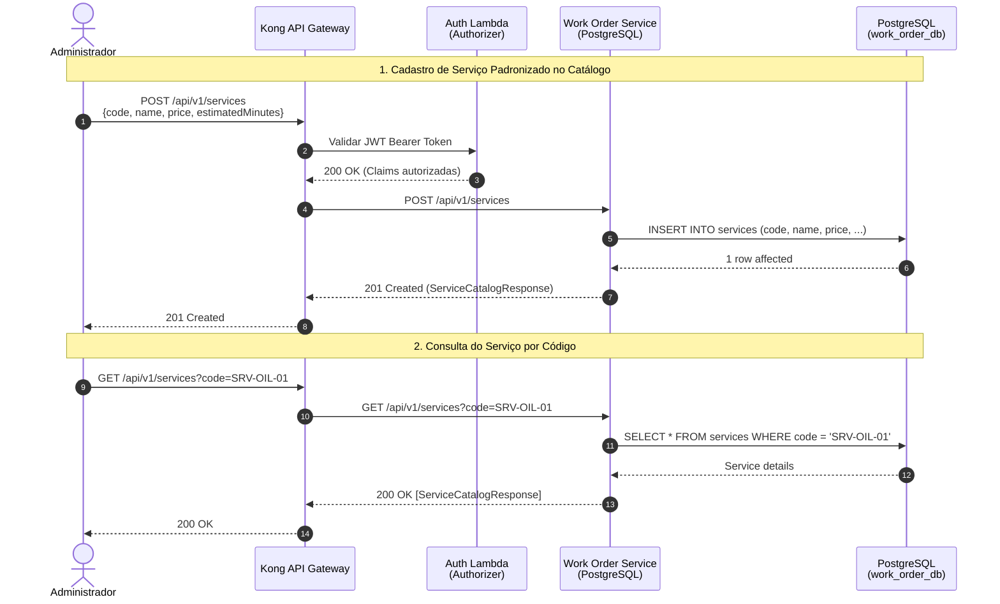

# Diagrama de Sequência: Gestão do Catálogo de Serviços

```mermaid
sequenceDiagram
    autonumber
    actor Admin as Administrador
    participant Kong as Kong API Gateway
    participant Auth as Auth Lambda<br/>(Authorizer)
    participant WorkOrder as Work Order Service<br/>(PostgreSQL)
    participant DB as PostgreSQL<br/>(work_order_db)

    Note over Admin,DB: 1. Cadastro de Serviço Padronizado no Catálogo
    Admin->>Kong: POST /api/v1/services<br/>{code, name, price, estimatedMinutes}
    Kong->>Auth: Validar JWT Bearer Token
    Auth-->>Kong: 200 OK (Claims autorizadas)
    Kong->>WorkOrder: POST /api/v1/services
    WorkOrder->>DB: INSERT INTO services (code, name, price, ...)
    DB-->>WorkOrder: 1 row affected
    WorkOrder-->>Kong: 201 Created (ServiceCatalogResponse)
    Kong-->>Admin: 201 Created

    Note over Admin,DB: 2. Consulta do Serviço por Código
    Admin->>Kong: GET /api/v1/services?code=SRV-OIL-01
    Kong->>WorkOrder: GET /api/v1/services?code=SRV-OIL-01
    WorkOrder->>DB: SELECT * FROM services WHERE code = 'SRV-OIL-01'
    DB-->>WorkOrder: Service details
    WorkOrder-->>Kong: 200 OK [ServiceCatalogResponse]
    Kong-->>Admin: 200 OK
```

