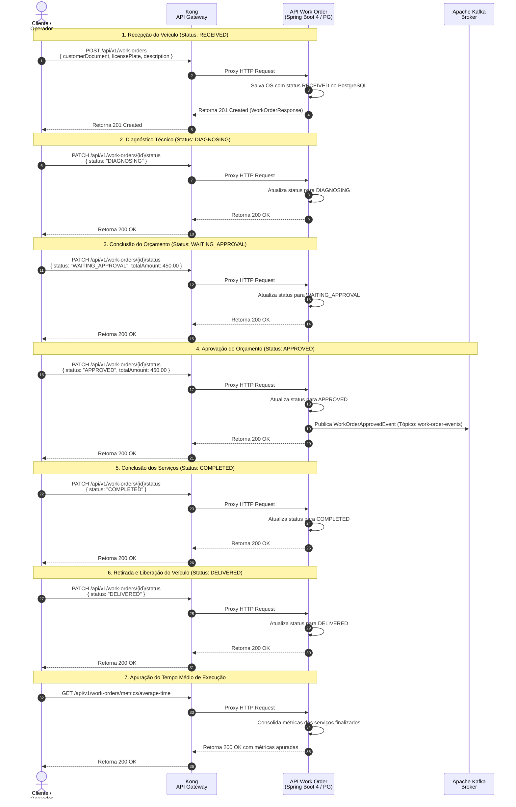

## Diagrama de Sequência

**Ciclo de Vida Completo da Ordem de Serviço (Referência: `work_order_lifecycle.feature`)**

Este diagrama documenta o fluxo operacional completo das 7 fases da Ordem de Serviço através do API Gateway Kong até o microsserviço de Ordens de Serviço, cobrindo recepção, diagnóstico, aprovação orçamentária, finalização, liberação e fechamento de métricas.

